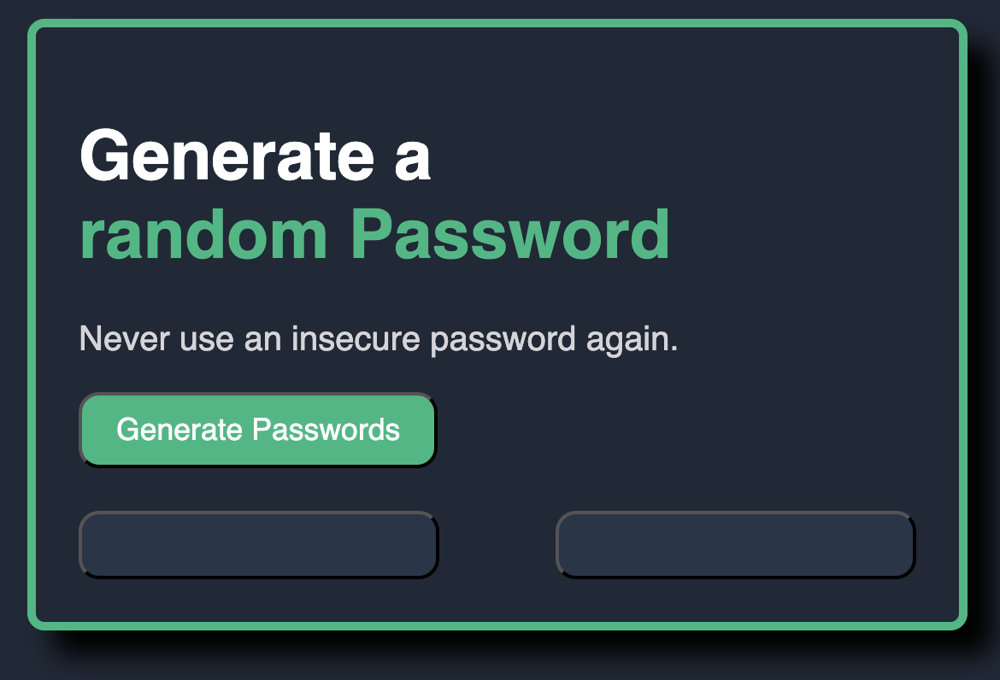

# Random Password Generator

This is a simple front-end web application that generates two random, secure passwords at the click of a button. It's built to demonstrate fundamental concepts of HTML, CSS, and JavaScript, including DOM manipulation and the Clipboard API.

## Generator UI

***

## Features

* **One-Click Generation**: Creates two unique, random passwords instantly.
* **Secure & Complex**: Passwords include a mix of uppercase letters, lowercase letters, numbers, and special symbols.
* **Click to Copy**: Easily copy either generated password to your clipboard by clicking on it. (coming soon)
* **Clean UI**: A simple, intuitive interface.

***

## Technologies Used

* **HTML5**: For the structure and content of the application.
* **CSS3**: For styling and layout.
* **JavaScript**: For password generation, DOM manipulation, and handling user events.

***

## How to Use

To run this project on your local machine:

1.  Download or clone the repository files.
2.  Open the `index.html` file in your favorite web browser.
3.  Click the **"Generate Passwords"** button to create new passwords.
4.  Click on either of the generated password fields to copy it to your clipboard.

***

## License

This project is licensed under the MIT License.
